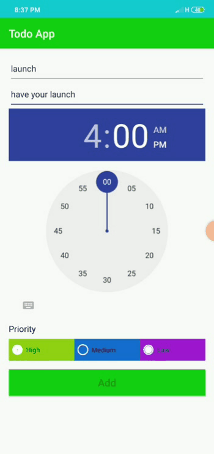

# dma-todo

Features
Local persistence using room DB
MVVM architecture
Material design
Getting Started
To run the project, check the prerequisites below, then clone the repo and build on Android studio or download the zip file

Prerequisites
Android Studio IDE 3.0+
Android SDK v28
Libraries
LiveData
ViewModel
Room
Author
Sushan Khatiwada